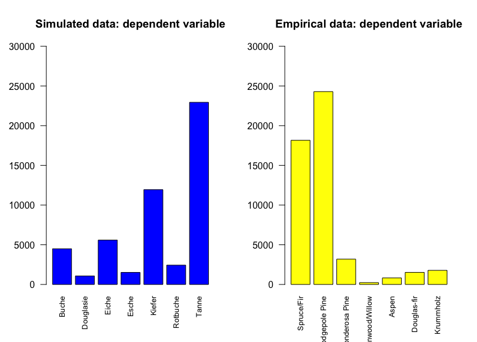
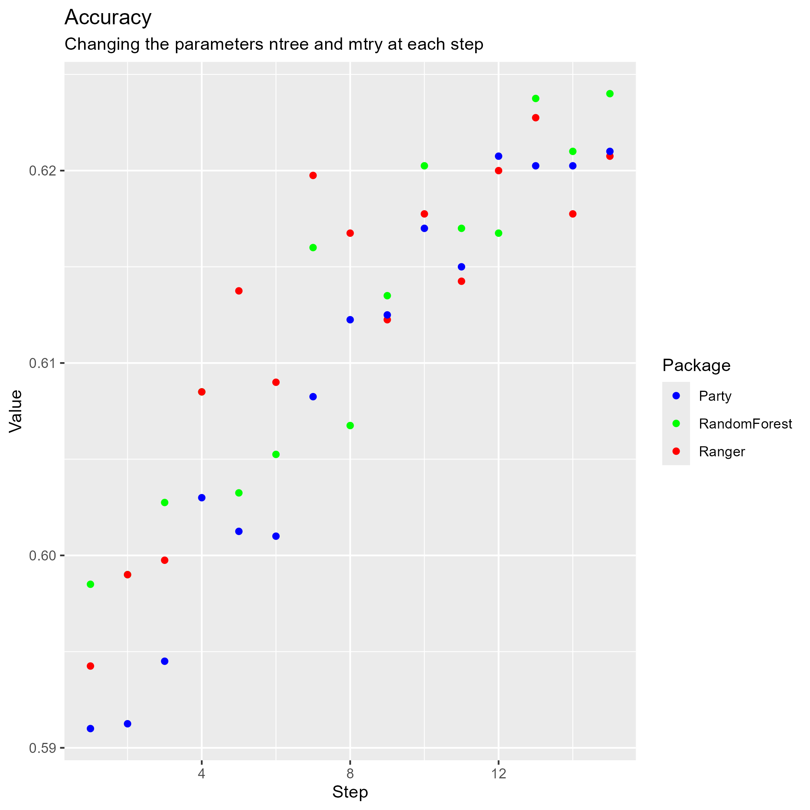
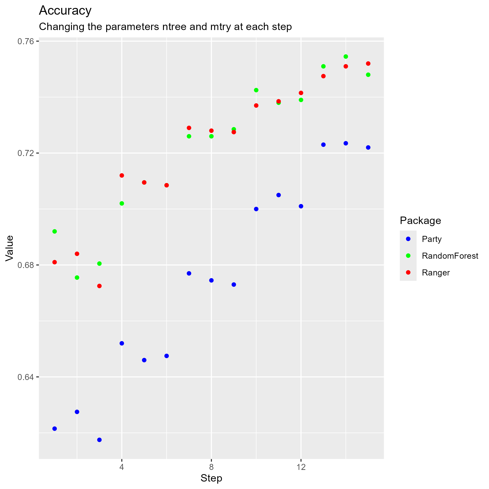
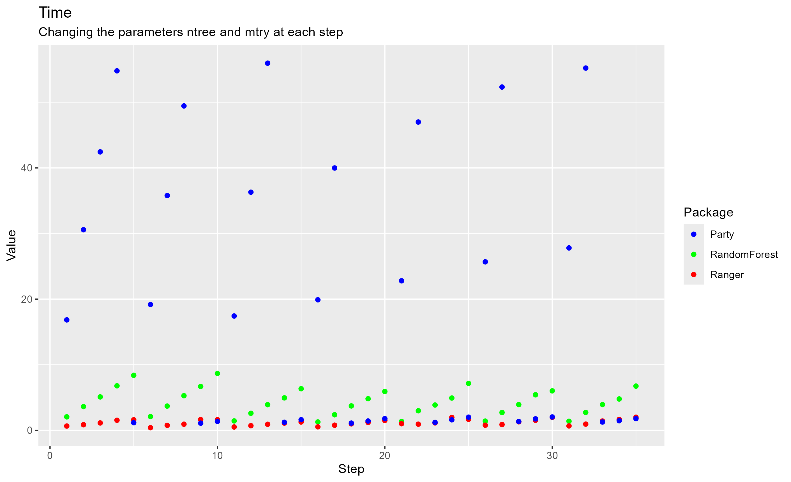
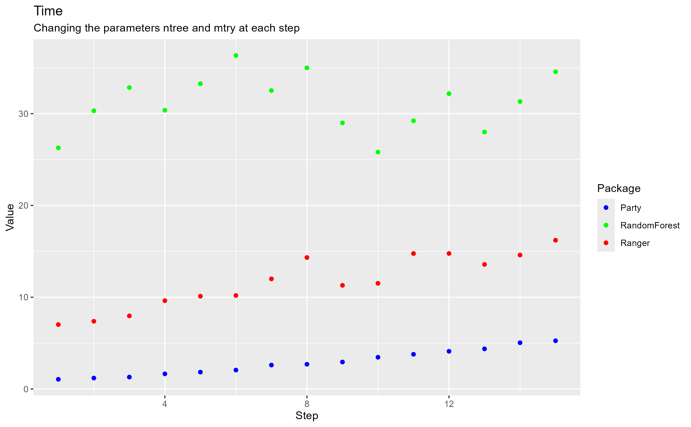
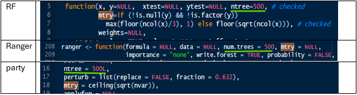
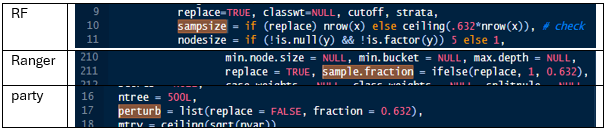
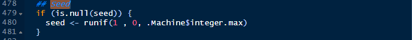
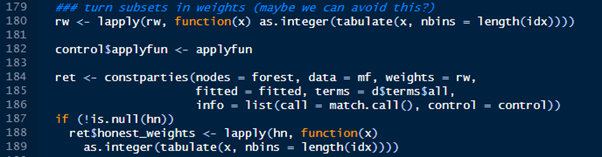

# Introduction

Data scientists, analysts as well as statisticians often face data sets with a large number of variables and observations. This requires not only increasing computational power, but also more efficient methods to handle high-dimensional data and make more accurate variable selection processes to improve predictions. For this purpose, different machine learning methods like decision trees or random forests have been developed. These were first introduced by @breiman1984. They also invented the term classification and regression trees (CART). Nowadays, trees and forests are commonly used procedures to build models for predictions of a variable of interest based on several input variables. They are implemented in statistical software like the R programming language with different packages.

In this paper, three different packages for R that offer solutions for random forests are analyzed. For this purpose, first the two most popular packages called "randomForest" and "Ranger" were chosen. "Party" was added to the repertoire which includes different functions for recursive partitioning. The afore-mentioned packages are benchmarked in terms of their computational performance and their prediction quality by applying the functions on simulated and empirical categorical data. While the performance is measured in terms of run-time, the prediction quality is compared with the accuracy, the F1- and F-$\beta$ Score. More details about these terms can be found in the following chapters. The motivation of this paper is to provide an empirically founded recommendation of R packages to potential users for different use-cases.

The paper is structured in the following way: At first, the intuition of tree-structured models and how these are grown is described. After providing comprehension for CART, the theory behind random forests will be covered. In the chapter about data and method of this paper, the structure of the study will be introduced. This is followed by providing background information on the selected R packages and reasons for pre-selecting the afore-mentioned R packages. Finally, the results will be summarized and concluded with recommendations for different use-cases of random forests.

# Theoretical Background

Tree-based methods can be used for the prediction of categorical as well as continuous data. While there is theory on both, random trees and random forests, covering both classification and regression, the analysis in this paper is limited to categorical data and classification. Therefore, the theoretical foundations of this paper start with classification trees.

## Classification Trees

Classification trees are a type of decision tree used in supervised machine learning to classify data into discrete categories. They are powerful tools for both predictive modeling and data analysis, particularly useful when the outcome variable is categorical. The basic idea behind classification trees is to split the data set into smaller, more homogeneous and distinct groups based on certain criteria, ultimately leading to a decision about the class to which a particular data point belongs [@james2021].

The splitting procedure in classification trees is a critical step that determines how the data set is divided at each node. The goal of splitting is to create groups of data that are as homogeneous as possible with respect to the target variable. The process involves selecting the best feature to split on, which maximizes the distinction between the classes. For each feature, the algorithm considers all possible splits. For categorical attributes, splits are considered for every possible subset of categories and their impurity is calculated. Impurity is a measure of how mixed the classes are in the data set. There are different methods to measure the impurity. The Gini index is most commonly used. It is defined as:

$$
G = \sum^K_{k=1} \hat{p}_{mk} (1-\hat{p}_{mk})
$$

where $\hat{p}_{mk}$ is the proportion of samples that belong to class $mk$ in the node and $K$ is the total number of classes. The split that results in the lowest impurity is chosen. This process is repeated recursively, splitting each subset further until a stopping criterion (e.g. maximum tree depth or a minimum number of observations per leaf) is met [@james2021; @breiman1984].

When built, a classification tree consists of different types of nodes: The tree starts with a root node that represents the entire dataset. This root node is split based on a feature that results in the most significant distinction between the classes. Nodes that result in a pure subset, where all data points belong to the same class, become terminal nodes, also known as leaves. Each leaf represents a final classification decision [@quinlan1986; @james2021].

One of the main advantages of classification trees is their interpretability. The visual structure of a tree is easy to understand, making it possible to explain the decision-making process to non-technical stakeholders. Furthermore, classification trees can handle both numerical and categorical data without requiring much preprocessing, such as normalization or scaling. However, classification trees are not without drawbacks. They are prone to overfitting, especially when the tree grows too deep, capturing noise rather than the underlying pattern. Techniques like pruning, where parts of the tree are removed after the initial training, can help mitigate this problem. Pruning in classification trees is a crucial step to balance the complexity of the model with its ability to generalize well to new data, making the model more robust and interpretable.

Additionally, classification trees may become unstable if small changes in the data lead to different splits and, consequently, different trees. To address this, ensemble methods like random forests are often employed, combining multiple trees to improve accuracy and robustness [@quinlan1986; @james2021].

## Random Forests

Random forests are an ensemble learning method that can be used for classification tasks. They are built upon the concept classification trees, but aim to improve accuracy and robustness by combining multiple trees into a single model.

This approach mitigates some of the key weaknesses of individual decision trees, such as overfitting and instability. Each tree in the forest is trained on a random subset of the data and a random subset of features. The final prediction is made by aggregating the predictions of all trees, typically through majority voting in classification tasks.

The random forest algorithm starts by creating multiple training data sets using a method called bootstrap sampling. This involves randomly sampling the original data set with replacement, meaning that some data points may appear multiple times in a sample, while others may not appear at all. Each of these bootstrapped data sets is used to train a different decision tree in the forest.

When splitting nodes in each tree, random forests add another layer of randomness by selecting a random subset of features (typically the square root of the total number of features $\sqrt p$) to consider for the split. In statistical programming languages, this functionality is often determined by the hyperparameter `mtry`. This helps ensure that the trees are diverse, reducing the correlation between them and improving the robustness of the final model.

Each decision tree in the forest is grown to its full depth without pruning. This allows each tree to capture detailed patterns in the data, though it may overfit on its own. However, since each tree is trained on a slightly different data set and set of features, their errors tend to cancel each other out when combined [@james2021].

After all trees have been trained, the random forest makes predictions by aggregating the outputs of the individual trees. The forest's prediction is the class that receives the majority of votes from the trees. By averaging the predictions of multiple trees, Random Forests tend to achieve higher accuracy than a single decision tree. This is because they reduce variance without substantially increasing bias. The randomness introduced by both bootstrap sampling and random feature selection helps prevent overfitting and the prediction is more generalized. Random forests are also more robust to noise or outliers in the data, since each tree sees only a subset of the data and features, so no single tree can dominate the predictions based on anomalies. In addition, random forests provide a measure of feature importance, indicating which features are most influential in making predictions. This is calculated based on how much each feature reduces impurity across the grown trees.

Random forests have a couple of disadvantages though. First, training a large number of trees can lead to tremendous need of computational resources, especially with high-dimensional data, where random forests are designed for. Since random forests require storing multiple trees, they can be particularly memory-intensive. Furthermore, while individual decision trees are easy to interpret, random forests, are more complex and less transparent. For the overall model it's harder to trace the exact decision-making process [@james2021; @breiman2001; @hastie2009].

# Data and Method

## Organisation of the Study

In line with the research question, empirical and simulated multinomial data is used while drawing on different implementations of the Random Forests algorithm to classify this data. Since the focus lies on comparing different R packages, different goodness of fit measures are considered after classification to evaluate the performance of the R packages. On the basis of the theory and the available information on the packages, it is expected that the Random Forests implementations perform similar across the different packages.

## Data Preparation

### Empirical Data

For this analysis, empirical data is utilized from a data set that originally stemmed from a project at Colorado State University and was later donated to the UC Irvine Machine Learning Repository [@blackard]. This data set contains information on cover tree types along with various cartographic characteristics of the surrounding area. In forestry, a cover tree type is determined by the most prevalent tree species in a specific forest area [@gislason2006]. In this data set, the variable `cover_type` indicates which of seven distinct tree species is the predominant and will be used as the dependent variable in the analysis.

As is visible in the figure at the end of the chapter, in the right chart, the dependent variable of the empirical data shows that the classes are highly imbalanced. As two of the seven classes make up the majority of all. This reflects the natural prevalence of certain tree types in the studied area.

With respect to the independent variable, the data set includes continuous as well as binary variables. There are 10 continuous variables capturing various physical and environmental characteristics of the forest areas, such as elevation and horizontal distance to water sources. Additionally, the data contains 44 binary variables representing different wilderness areas and different soil types. In total, this amounts to `p = 54` predictors, with the data set comprising `n = 581,012`.

Given the large number of observations and predictors, this data is suitable for the study. Since the format of the data set aligns with the study's requirements, only minimal data preparation was needed. The data did not contain any missing values, therefore preparation mainly involved specifying the dependent variable as a factor variable. Additionally, a subset of `n = 20,000` observations was randomly sampled from the original data, which was then divided into training and testing sets with an "80:20" split to ensure a robust evaluation of the models.

### Simulated Data

In addition to the empirical data, simulated data has also been used in order to obtain a large number of observations and predictors. The following describes the simulation of the second data set, which uses a function specifically created for this purpose, `gen_dataset`. To generate artificial multinomial data and predictor variables, random draws from different probability distributions---including normal, beta, and uniform distributions---were used.

```{r}
gen_dataset <- function(p, n, min_cor, max_cor, reg = F){
  
  # generate x values
  x <- paste0(rep("x", p), 0:(p-1))
  
  x_val <- matrix(data = 0, 
                  nrow = n,
                  ncol = p)
  
  x_val[, 1] <- 1
  
  # different distributions for x 
  dist_disc <- sample(c("norm", "beta",  "uni"),
                      p,
                      replace = T,
                      prob = c(0.6, 0.25, 0.15))
  
  # generating x by drawing out of different distributions
  for(i in 2:p){
      
      if(dist_disc[i] == "norm"){
      
      mu <- rnorm(1, 0, 2)
      sig <- sample(seq(0.5, 10, 0.1), 1)
      
      x_val[, i] <- rnorm(n, mu, sig)
      
    }else if(dist_disc[i] == "beta"){
      
      alpha <- sample(seq(0.5, 5, 0.1), 1) 
      beta <- sample(seq(0.5, 5, 0.1), 1) 
      
      x_val[, i] <- rbeta(n, alpha, beta)
      
    }else{
      
      min_u <- sample(seq(0, 0.5, 0.01), 1)
      max_u <- sample(seq(0.51, 1, 0.01), 1)
      
      x_val[, i] <- runif(n, min_u, max_u)
      
    }
    
  }
  
  # generating correlations in-between the id variables
  
  cor_var <- sample(seq(min_cor, max_cor, 0.05), p, replace = T)
  
  idx_var <- vector("numeric", p)
  
  for(i in 2:p){
    
    idx_var[i] <- sample(c(1:p)[-i], 1)
    
  }
  
  for(i in 2:p){
    
    idx <- sample(1:n, abs(n*cor_var[i]))
    
    # for positive correlation
    if(cor_var[i] > 0){
      
      x_val[idx, i] <- 1.351*x_val[idx, idx_var[i]]
      
      # for negative correlation   
    }else{
      
      x_val[idx, i] <- -1.351*x_val[idx, idx_var[i]]
      
    }
    
  }
  
  # beta weights for the regression model
  beta <- sample(seq(-1, 2, 0.1), p, replace = T)
  
  # epsilon
  epsi <- rnorm(n)
  
  # calculate y
  y <- x_val %*% as.vector(beta) + epsi
  
  # generating multinomial y
  y <- ifelse(y >= min(y) & y < -5, "Tanne",
              ifelse(y >= -5 & y < -1, "Esche",
                     ifelse(y >= -1 & y < 5, "Rotbuche",
                            ifelse(y >= 5 & y < 20, "Eiche", 
                                   ifelse(y >= 20 & y < 23, "Douglasie",
                                          ifelse(y >= 23 & y < 37, "Buche", "Kiefer"))))))
  
  # beta weights 
  beta <- sample(seq(-1, 2, 0.1), p, replace = T)
  
  # epsilon
  epsi <- rnorm(n)
  
  # calculate y
  y_sick <- x_val %*% as.vector(beta) + epsi
  
  # generating binomial y
  y_sick <- ifelse(y_sick >= min(y_sick) & y_sick < 0, "sick", "non-sick")
  
  out <- cbind.data.frame(as.factor(y), 
                          as.factor(y_sick),
                          x_val[, -1])
  
  # rename 
  colnames(out) <- c("y", "y_sick", paste0("x", 2:p)) 
  
  out
  
}

```

The simulated data consists of a dependent multinomial variable representing seven different tree types, while a large number of predictor variables were generated using the aforementioned distributions. To mimic real-world data characteristics, correlations between the predictors were also incorporated into the simulation process.

The function `gen_dataset` generates a vector of random values between `min_cor` and `max_cor`, both arguments specified manually in advance. For each variable, a random index is assigned from the remaining variables to create correlations. Observations are then selected based on the absolute value of the correlation. If the correlation is positive, the values of the variable are positively correlated with the chosen variable; if negative, they are negatively correlated.

The final data set is generated with `p = 36`continuous predictor variables, `n = 20,000` observations, and correlations between `min_cor = -0.3` and `max_cor = 0.5`. While the function creates two outcome variables, the multinomial variable representing cover tree types and a binary variable indicating tree health, only the multinomial variable will be used for classification, as computational limits in this analysis only allow classifying a single variable. The distribution of the multinomial dependent variable `y` is shown below.\
In the left chart of the figure below, the distribution is more balanced than for the empirical data, with four out of the seven classes making up the majority of all.

```{r, echo=FALSE}

```

## GoF-measures

To evaluate the performance of the Random Forest models, the following Goodness-of-Fit (GoF) measures are used:

### Accuracy

Accuracy is one of the most straightforward evaluation metrics, representing the proportion of correctly predicted observations to the total number of observations. It is calculated as:

$$
\text{Accuracy} = \frac{\text{True Positives} + \text{True Negatives}}{\text{Total Observations}}
$$

While accuracy is useful when the classes are well-balanced, it can be misleading in cases where the classes are imbalanced, as it does not consider the types of errors made by the model.

### F1-Score

The F1-Score is particularly useful in scenarios where the distribution of classes is imbalanced, as it provides a more nuanced measure of a model's performance than accuracy [@forman2003, p. 9].

The F1-Score is a weighted average of precision and recall, providing a single metric that balances both false positives and false negatives. Precision (also known as positive predictive value) and recall (or sensitivity) are calculated as:

$$
\text{Precision} = \frac{\text{True Positives}}{\text{True Positives} + \text{False Positives}}
$$

$$
\text{Recall} = \frac{\text{True Positives}}{\text{True Positives} + \text{False Negatives}}
$$

The F1-Score is then calculated as:

$$
\text{F1-Score} = 2 \times \frac{\text{Precision} \times \text{Recall}}{\text{Precision} + \text{Recall}}
$$

### F-$\beta$ Score

The F-$\beta$ Score is a generalization of the F1-Score, allowing for a greater emphasis on either precision or recall by adjusting the value of $\beta$. When $\beta = 1$, the F-$\beta$ Score is equivalent to the F1-Score, giving equal weight to both precision and recall. For $\beta < 1$, more weight is given to precision, while for $\beta > 1$, recall is prioritized. The formula for the F-$\beta$ Score is:

$$
F_\beta = (1 + \beta^2) \times \frac{\text{Precision} \times \text{Recall}}{(\beta^2 \times \text{Precision}) + \text{Recall}}
$$

By adjusting $\beta$, users can fine-tune the performance measure according to their specific needs, depending on whether false positives or false negatives are more critical for the problem at hand [@ali2024, p. 50].

## The Different Packages

As the focus in this study lies on comparing different R packages, a short introduction to each of the packages is needed. Each package has its own underlying philosophy. First, the *randomForest*-package is described, followed by *ranger* and lastly, the *party*-package [@hothorn2024] is introduced.

The three packages are selected for different reasons. First, randomForest can be regarded as one of the standard packages implementing the random forest algorithm. In the literature, it is stated that the package is "feature-rich and widely used" [@wright2017, p. 1]. Therefore, randomForest was the inital choice for the analysis in this paper. Secondly, the ranger-package is able to handle a large number of features at the same time [@wright2017]. In this aspect, the ranger-package stands out among the different implementations of the random forest algorithm. In the party-package, lastly, the implementation of random forest is slightly different to the other R packages. This can be regarded as a promising aspect for which reason the package is included in the analysis.

Whilst preparing the analysis, other packages with random forest implementations were looked at but were not chosen for the final analysis. The R package caret presents itself as multi-functional whereas not specialized in implementing the random forest algorithm. Moreover, an initially high runtime was reported [@wright2017]. For these reasons, caret was not included in the analysis. @wright2017 also reported on the package rJungle which, on the one hand, is optimized for high dimensional data. On the other hand, rJungle is no longer maintained and has later merged into the ranger-package, which is already included in the analysis. Finally, the R package Rborist was considered in order to decide whether it should be included in the analysis. Compared to other packages, Rborist requires extensive fine-tuning of hyperparameters and of the function's arguments to achieve an equally high accuracy and performance [@wright2017]. Excluding Rborist from the analysis therefore seemed plausible.

### RandomForest

The package *randomForest* draws on the original algorithm described in @breiman2001 and originally published in Fortran [@breiman2002]. As randomForest can be regarded as one of the standard packages implementing the random forest algorithm in the function `randomForest`, the documentation of the package is extensive and gives the user plenty of advice on how the implemented functions work or which arguments can be specified. Additionally, developers can access the open-source published code to gain an even deeper understanding of the parameters used in defining the function `randomForest`.

The type of dependent variable which is to be predicted determines whether classification or regression is performed using the random forest algorithm whereas the implementation of the two prediction methods slightly differs [@liaw2002]. This fact might be relevant for users interested in both, classification as well as regression, while there is no significance for the use in this paper.

In comparison to other packages implementing the random forest algorithm, randomForest requires to manually specify parallelization techniques to optimize run-time and performance. This can be regarded as a disadvantage of the package.

### Ranger

The R package random forest generator (known as "Ranger") package is an implementation for random forests with optimizations for high dimensional data in R [@schwarz2010]. The developers claim to provide a package which is comparably simple to use [@wright2017, p. 2].

The package is optimized by extensive memory profiling for different types of input data. As a random forest is proceeded in R, all values of all features of `mtry` are splitting candidates. Since the required computational power increases exponentially with added features, this is the bottleneck for many random forest packages and the developers of the ranger package focused on this problem.

The `ranger` function is used to grow a forest and makes use of two different algorithms for the splitting process. At first, the feature values are sorted and accessed by their index. In the second algorithm, the values are sorted and retrieved while splitting.

Other than the package randomForest, Ranger is license free and the software is open-source released which improves traceability of the functions for users on the one hand and accessible for implementation of new features by other developers on the other hand [@wright2017, pp. 2.]. It stands out, that the code for ranger is written in C++ and uses standard libraries only. C++ is described as a low-level language, which expresses in a machine-oriented design and more efficient use of memory [@haidl2017]. This makes parallel processing available and considerably accelerates the runtime. Besides from CART, survival trees are also supported by the ranger package.

### Party

The documentation of the *party*-package states differences to the *randomForest*-package in the basic implementation, i.e. different base learners were used [@hothorn2024, p. 6]. Whereas the *randomForest*-package draws on Classification and Regression Trees (CART) to form a random forest, the *party*-package utilizes conditional inference trees in the `cforest` function designed to prevent overfitting and variable selection bias while combining statistical testing and the basic ideas of CART [@hothorn2006].

In general, the party-package is designed for recursive partitioning [@wright2017]. At the same time, similar to the randomForest-package and in comparison to the ranger-package, party is not specifically optimized for high-dimensional data and requires to manually specify parallelization techniques.

## Cross-Validation

For the cross-validation, a function `cv_rf` is created to apply classification by the Random Forests algorithm, while drawing on the functions implemented in the R packages described in section 3.4: `randomForest`, `ranger`, and `cforest`. With `cv_rf`, the models' performance based on Accuracy, F1 score, and F-\$\\beta\$ score is estimated, while also recording the computational time taken to fit each model.

``` r
cv_rf <- function(train_data, test_data, y, mtry, ntree,
                  replace = NULL, formula = NULL, f_beta = 0.5){
  
  # checking for string in formula
  if(is.character(formula)==T){
    
  }else{
    print("Formula needs to be written as character")
    break
  }
  
  # matrix for the acc, f_one and f_beta
  gof_out <- matrix(0, nrow = 3, ncol = 4)
  
  # Function randomForest
  time_rf <- Sys.time()
  
  obj_rf <- randomForest(eval(parse(text = formula)),
                         data = train_data,
                         type = "classification",
                         ntree = ntree,
                         mtry = mtry)
  
  # time
  gof_out[1, 4] <- Sys.time() - time_rf
  
  y_pred <- predict(obj_rf, newdata = test_data)
  
  table(y_pred)
  
  # Compute the accuracy
  acc <- cbind.data.frame(y, y_pred)
  table(acc)
  
  gof_out[1, 1] <- sum(diag(table(acc)))/sum(table(acc))
  
  # compute the F1 Score
  gof_out[1, 2] <- F1_Score(y_true = acc$y,
                            y_pred = acc$y_pred)
  
  # Compute Fbeta Score
  gof_out[1, 3] <- FBeta_Score(y_true = acc$y,
                               y_pred = acc$y_pred,
                               beta = f_beta)
  
  # Function ranger
  time_rngr <- Sys.time()
  
  obj_rngr <- ranger(eval(parse(text = formula)),
                     data = train_data,
                     num.trees = ntree,
                     mtry = mtry,
                     num.threads = 1)
  
  # time
  gof_out[2, 4] <- Sys.time() - time_rngr
  
  y_pred <- predict(obj_rngr, data = test_data)$predictions
  
  table(y_pred)
  
  # Compute the accuracy
  acc <- cbind.data.frame(y, y_pred)
  table(acc)
  
  gof_out[2, 1] <- sum(diag(table(acc)))/sum(table(acc))
  
  # compute the F1 Score
  gof_out[2, 2] <- F1_Score(y_true = acc$y,
                            y_pred = acc$y_pred)
  
  # Compute Fbeta Score
  gof_out[2, 3] <- FBeta_Score(y_true = acc$y,
                               y_pred = acc$y_pred,
                               beta = f_beta)
  
  # Function caret
  time_bor <- Sys.time()
  
  obj_crf <- cforest(formula = eval(parse(text = formula)),
                     data = train_data, 
                     controls = cforest_unbiased(ntree = ntree, 
                                                 mtry = mtry))
  
  # time
  gof_out[3, 4] <- Sys.time() - time_bor
  
  y_pred <- predict(obj_crf, newdata = test_data)
  
  table(y_pred)
  
  # Compute the accuracy
  acc <- cbind.data.frame(y, y_pred)
  table(acc)
  
  gof_out[3, 1] <- sum(diag(table(acc)))/sum(table(acc))
  
  # compute the F1 Score
  gof_out[3, 2] <- F1_Score(y_true = acc$y,
                            y_pred = acc$y_pred)
  
  # Compute Fbeta Score
  gof_out[3, 3] <- FBeta_Score(y_true = acc$y,
                               y_pred = acc$y_pred,
                               beta = f_beta)
  
  
  gof_out
  
}
```

By using parallelization techniques, various hyperparameter combinations (`ntree` and `mtry`) are efficiently tested. The function is run across all combinations while collecting the results for further analysis.

The cross-validation is targeted at obtaining the optimal hyperparameter combinations as measured in different goodness-of-fit indicators for each type of data, empirical as well as simulated data,.

Mathematically interesting are the different default settings for the hyperparameters `ntree` and `mtry`. For example, the default value of `mtry` in the party-package is `mtry = 5` while in *randomForest* `mtry = sqrt(p)` is specified.

# Results

**(PARAMETER GENUTZT):\
n=20.000** ;n_tree seq(450,550,50), mtry 3:7

Now it will be analysed, what the algorithm cv_rf computed as an output for each of the three packages. At first sight packages show different patterns in case of the used computational time and the measurements of Goodness of Fit (GoF). The Pattern of the packages look similar. Each step stands for a different hyperparameter combination (1 - (ntree = 450, mtry = 3), 2 - (ntree = 450, mtry = 4), 3 - (ntree = 450, mtry = 5), 4 - (ntree = 450, mtry = 6), 5 - (ntree = 450, mtry = 7) and so on).

In case of the accuracy (comparing the two plots beneath), it can be seen, that the randomForest and ranger are generating higher values than the party package for both empirical and theoretical data. This can be seen especially for the empirical data, where the party package performs less efficient than randomForest and ranger. The pattern seems to be similar regarding the slope. Overall, the values for every package for the empirical data are higher than for the simulated data.





For the F1-Score (comparing the two plots beneath) the same assumption yields. randomForest achieves the highest score overall compared to the other packages for the combination ntree = 550 and mtry = 7 -- this yields for the simulated data. For the empirical data ranger performs best.


The F-Beta-Score (comparing the two plots beneath) shows the same behaviour for the several packages. Party achieves the highest score overall compared to the other packages for the combination ntree = 550 and mtry = 6 -- this yields for the simulated data. For the empirical data ranger performs best. This could be a hint, that those packages perform better in case of precision.


Regarding the time (comparing the two plots beneath) for the simulated data party is less time consuming than the other ones. ranger is most time consuming, with a break at the end, where ranger performs best. For the empirical data party is less time consuming, where as randomForest is most time consuming.





One of the reasons for the different behaviour with respect to computational time and the GoF could be those hyperparameters in the functions which were not tested in the analysis. For this reason, the analysis included a further investigation of how the random forest algorithm was implemented in the different packages. The source code can be accessed via CRAN for each individual package. All of the three analyzed packages refer to other programming languages for the computation of the random forest algorithm itself.

In case of the randomForest package, the computation of the random forest algorithm is written in Fortran, with an R port to provide access to the implementation in R [@breiman2002]. The ranger package refers to C++ [@wright2017] while in the case of the party package, it is not clarified how the algorithm is implemented apart from the R function [@hothorn2024; @hothorn2024a]. For the final implementation in the R functions, each package includes helper functions checking and adjusting the hyperparameters. The manual specification via specifying the arguments of the packages' functions serves as an input for the function in the background, which computes the desired output.

It can be seen that the default argument in randomForest, ranger and party is the same for `ntree = 500` (green marks in the imagine beneath). Also, the number of variables used for each split for the selection `mtry` can be specified. Comparing the R packages, it can be seen that `mtry = floor(sqrt(ncol(x)))` for randomForest, which adjusts downward and `mtry = ceiling(sqrt(nvar))` for party, which adjusts upward (orange marks in the imagine beneath). The ranger package does not adjust this hyperparameter in the R source code, therefore, the expectation is an implementation in the C++ script. Nonetheless, the documentation of the ranger package states $\sqrt p$ as the default argument.

```{r, echo=FALSE}

```

Another important part is the hyperparameter `sampsize` (randomForest), `sample.fraction` (ranger) and `perturb` (party). This parameter adjusts the fraction or number of observations to sample or draw -- for classification, this parameter equals `1`.

```{r, echo=FALSE}

```

One major argument why the predicted results differ is described in the documentation of the party package [@hothorn2024, p. 6]:

"Moreover, when predictors vary in their scale of measurement of number of categories, variable selection and computation of variable importance is biased in favor of variables with many potential cutpoints in randomForest, while in cforest unbiased trees and an adequate resampling scheme are used by default."

This could be another reason for the findings of the analysis in this paper while also the adjusted seed in the ranger package could play a role. This argument states `seed = runif(1, 0, max)`, which is the seed included in the C++ function.

```{r, echo=FALSE}

```

Interestingly to note is the differing performance between varying specifications of n = 20,000 and n = 10,000. This yields especially for the simulated data.


Compare this image with the image above for the F-Beta Score for empirical data.

# Conclusion

From the point of view of random forest beginners, it is reasonable to start with basic packages which provide good documentation and well explained hyperparameters. For this reason, this paper recommends using the R package randomForest itself. The randomForest package is a direct product of Leo Breiman, which could be used as useful link between theory and practice.

For users familiar with the random forest algorithm, it is recommended to use the ranger package. Ranger provides a more detailed documentation and allows for specifying more hyperparameters. As the ranger package is optimized for high-dimensional data and includes parallelization techniques, this aspect presents itself as starting points for future research. The performance could be improved by increasing the number of threads used while the default are the available CPUs.

Lastly, the party package offer a special kind of the random forest algorithm as the function `cforest` provides an alternative with conditional random forests. The documentation of the package and especially for the `cforest` function can be improved compared to the extensive documentation of the other two packages included in the analysis of this paper. Similar to the ranger package, the party package draws on parallelization techniques without further specifying the actual implementation. This package seems to be in process of developing (see the comment above the code in the following image):

```{r, echo=FALSE}

```

The party package can be seen as package example of a random forest implementation build from scratch. For users interested in building own functions or own implementations for the random forest algorithm, the party package could be a potential candidate.

For further information and deep dive into the code of the actual computation of the random forest this should be regarded by someone with advanced programming skills. It would be worth a deep dive into the code programmed in C++ and Fortran to get an understanding of the actual computations.

There cloud be also an interesting opportunity to study the behaviours of the packages regarding the samplesize n=10000. Here this paper discovered in the preparation of the actual output, that the party package could perform less efficient in sense of the used GoF – this can be in regard to the F1- and the F-beta score. Here seems to be potential in regarding the comparison of the performence and the samplesize of a dataset - which packages is more efficient?

# References
